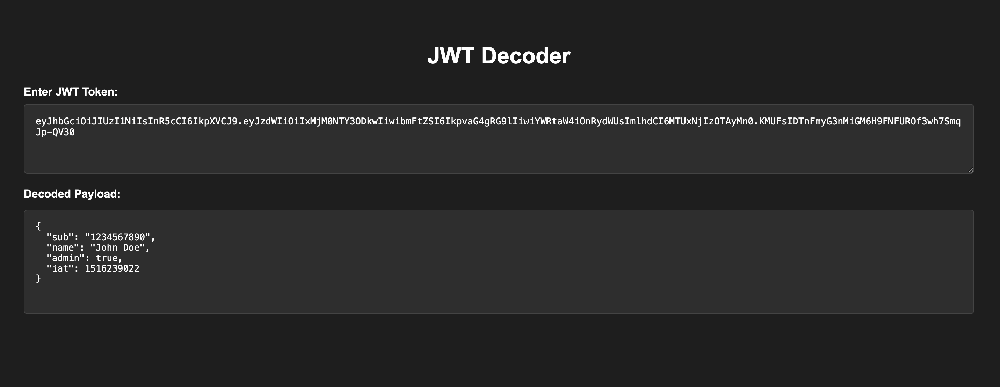

# Developer Tools

All tools are client side.  
Built with HTML, CSS, and javascript. No externals calls, not even to fetch a library.

## List of tools.

### A JWT decoder:
Shows the payload property of the token.

### URL Encode/Decoder
A tool that converts URL encoded text into plain text and vide-versa.

### HTML render:
Enter any valid HTML in to the box, and it will render to the right of the screen.

